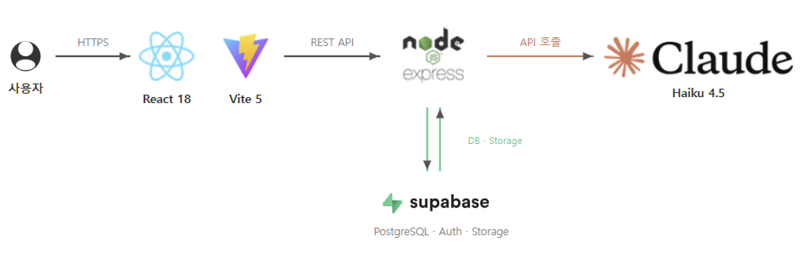

# 🐾 한발짝 — AI 과업 분해 & 집중 관리 서비스

<div align="center">
  
</div>

> 막막한 할 일, AI가 실행 가능한 단계로 나눠드립니다.

🔗 **[서비스 바로가기](https://hanbaljjak-frontend.vercel.app/)** &nbsp;|&nbsp; [팀페이지](https://kookmin-sw.github.io/2026-capstone-25/)

---

## 🔗 목차

1. [💡 프로젝트 소개](#-프로젝트-소개)
2. [🦾 주요 기능](#-주요-기능)
3. [🎬 시연 영상](#-시연-영상)
4. [👋 팀원 소개](#-팀원-소개)
5. [🌐 시스템 구조](#-시스템-구조)
6. [🛠 기술 스택](#-기술-스택)
7. [🚀 실행 방법](#-실행-방법)
8. [📂 디렉토리 구조](#-디렉토리-구조)
9. [⚙️ 배포](#️-배포)
10. [📝 소개 자료](#-소개-자료)

---

## 💡 프로젝트 소개

캘린더 앱은 이미 아는 일정을 배치하고, 할 일 앱은 이미 쪼개진 과업을 관리합니다.  
**한발짝**은 그 앞 단계를 해결합니다.

- ✅ **한발짝**은 Claude API를 활용해 복잡한 과업을 즉시 실행 가능한 단계로 자동 분해합니다.
- ✅ **한발짝**은 집중 타이머로 분해된 과업을 실행까지 이어줍니다.
- ✅ **한발짝**은 캘린더 배치, 진행 관리, 리포트를 통해 입력부터 완주까지 끊김 없는 흐름을 제공합니다.

---

## 🦾 주요 기능

### 📝 입력 & 템플릿
- 학업·개발·글쓰기·취업·창작·생활·여행·건강 8개 카테고리 템플릿 제공
- 예상 기간·규모·분해 예시를 미리 확인 후 선택

### 🤖 AI 과업 분해
- Claude API (Haiku 4.5) 기반 과업 자동 분해
- 분해 결과가 마음에 들지 않으면 재분해 또는 자연어 피드백으로 조정
- 원하는 단계를 선택해 2차 세분화 가능

### ⏱ 집중 타이머
- 원형 프로그레스 링 타이머 지원
- 집중 시간 누적 기록 및 헤더 실시간 반영

### 🌲 단계 트리 & 진행 관리
- 분해 계보 시각화 및 드래그 정렬
- 완료·진행·대기 상태 관리

### 📅 캘린더 일정 배치
- 주간·월간 캘린더에 단계 배정
- 날짜별 투두 자동 정렬 및 프로젝트별 색상 표시

### 📊 주간 리포트
- 실행력·완료력·일정 신뢰도 자동 분석
- AI 자동 코멘트·4주 집중 추이·프로젝트별 시간 분배 제공

---

## 🎬 시연 영상

[](https://www.youtube.com/watch?v=EO2LgYwzoeQ)

---

## 👋 팀원 소개

<table>
  <tr align="center">
    <td style="min-width: 120px;">
      <a href="https://github.com/eun031006">
        
        <br/>
        <b>이재은</b>
      </a>
      <br/>20223123
    </td>
    <td style="min-width: 120px;">
      <a href="https://github.com/jhllee">
        
        <br/>
        <b>이지희</b>
      </a>
      <br/>20223129
    </td>
  </tr>
  <tr align="center">
    <td>Full Stack<br/>AI 분해 엔진 설계·구현<br/>파일 파싱, 입력/결과 UI</td>
    <td>Full Stack<br/>타이머, 캘린더, 리포트<br/>DB 설계, RLS 정책</td>
  </tr>
</table>

---

## 🌐 시스템 구조

<div align="center">
  
</div>

---

## 🛠 기술 스택

### 🖥️ Frontend

| 역할 | 기술 |
|------|------|
| **Language** |  |
| **Framework** |  |
| **Build Tool** |  |
| **Styling** |  |

### 🖥️ Backend

| 역할 | 기술 |
|------|------|
| **Language** |  |
| **Runtime** |  |
| **Framework** |  |
| **Database** | -3ECF8E?style=for-the-badge&logo=Supabase&logoColor=white) |
| **Auth** |  |

### 🤖 AI

| 역할 | 기술 |
|------|------|
| **API** |  |
| **Model** |  |

### ☁️ Deployment

| 역할 | 기술 |
|------|------|
| **Frontend** |  |
| **Backend** |  |
| **DB / Auth** |  |

### 🔧 Common

| 역할 | 기술 |
|------|------|
| **Version Control** |   |
| **Design** |  |
| **Communication** |  |

---

## 🚀 실행 방법

### 사전 요구사항

- Node.js 20 이상
- npm 10 이상

### 1. 소스 다운로드

```bash
git clone https://github.com/kookmin-sw/2026-capstone-25.git
cd 2026-capstone-25
```

### 2. 의존성 설치

```bash
npm install
```

### 3. 환경변수 설정

**`backend/.env`**

| 변수 | 설명 |
|---|---|
| `ANTHROPIC_API_KEY` | Anthropic API 키 |
| `ANTHROPIC_MODEL` | 모델 ID (기본: `claude-haiku-4-5-20251001`) |
| `SUPABASE_URL` | Supabase 프로젝트 URL |
| `SUPABASE_SERVICE_ROLE_KEY` | service_role 키 |
| `FRONTEND_ORIGIN` | 허용 도메인 (기본: `http://localhost:5173`) |
| `PORT` | 서버 포트 (기본: `4000`) |

**`frontend/.env`**

| 변수 | 설명 |
|---|---|
| `VITE_SUPABASE_URL` | Supabase 프로젝트 URL |
| `VITE_SUPABASE_ANON_KEY` | Supabase anon 키 |
| `VITE_API_BASE_URL` | 백엔드 API URL (기본: `http://localhost:4000`) |

### 4. 실행

```bash
npm run dev        # 프론트(5173) + 백엔드(4000) 동시 실행
```

| 서비스 | 주소 |
|---|---|
| 프론트엔드 | http://localhost:5173 |
| 백엔드 API | http://localhost:4000 |

### 기타 명령어

```bash
npm run typecheck  # 타입 체크 (양쪽)
npm run build      # 빌드 (양쪽)
```

---

## 📂 디렉토리 구조

```
📦 hanbaljjak (모노레포)
│
├── 📁 frontend
│   ├── 📁 src
│   │   ├── 📁 components          # 공통 UI 컴포넌트
│   │   ├── 📁 pages               # 페이지별 컴포넌트
│   │   │   ├── HomePage.tsx       # 할 일 입력 & AI 분해 요청
│   │   │   ├── ResultPage.tsx     # 분해 결과 확인
│   │   │   ├── AllPage.tsx        # 전체 프로젝트 목록
│   │   │   ├── ProjectDetailPage.tsx  # 프로젝트 상세 & 단계 관리
│   │   │   ├── CalendarPage.tsx   # 캘린더 일정 배치
│   │   │   ├── TimerPage.tsx      # 집중 타이머
│   │   │   ├── ReportPage.tsx     # 주간 리포트
│   │   │   └── MePage.tsx         # 계정
│   │   ├── 📁 lib                 # 유틸리티 (toast 등)
│   │   ├── 📁 schemas             # zod 공유 스키마
│   │   └── 📁 services            # API 호출 함수
│   ├── package.json
│   └── vite.config.ts
│
├── 📁 backend
│   ├── 📁 src
│   │   ├── 📁 routes              # API 라우트
│   │   │   ├── decompose.ts       # AI 분해 엔드포인트
│   │   │   ├── projects.ts        # 프로젝트 CRUD
│   │   │   ├── steps.ts           # 단계 관리
│   │   │   ├── calendar.ts        # 일정 배정
│   │   │   ├── timer.ts           # 타이머 기록
│   │   │   ├── report.ts          # 주간 리포트 집계
│   │   │   └── me.ts              # 사용자 정보
│   │   ├── 📁 prompts             # AI 시스템 프롬프트
│   │   ├── 📁 schemas             # zod 공유 스키마
│   │   ├── 📁 validate            # VALIDATE 파이프라인 로직
│   │   ├── 📁 middleware          # Express 미들웨어
│   │   ├── env.ts                 # 환경변수 검증
│   │   └── index.ts               # 서버 진입점
│   └── package.json
│
├── 📁 설계                        # 설계 문서 & 다이어그램
└── package.json                   # 모노레포 루트
```

---

## ⚙️ 배포

### Vercel (프론트)
1. GitHub 연결 → **Root Directory**: `frontend` / **Framework**: Vite
2. 환경변수: `VITE_SUPABASE_URL`, `VITE_SUPABASE_ANON_KEY`, `VITE_API_BASE_URL`

### Railway (백엔드)
1. GitHub 연결 → **Root Directory**: `backend`
2. **Build Command**: `npm run build` / **Start Command**: `npm run start`
3. 환경변수: `ANTHROPIC_API_KEY`, `ANTHROPIC_MODEL`, `SUPABASE_URL`, `SUPABASE_SERVICE_ROLE_KEY`, `FRONTEND_ORIGIN`, `PORT`

### Supabase
- Auth → URL Configuration: **Site URL** + **Redirect URLs**에 Vercel 도메인 추가
- 모든 테이블 RLS 활성 확인

---

## 📝 소개 자료

- [📊 최종 발표 자료](https://drive.google.com/file/d/1FuiwA1HQW5qvPgR-6YuhQqG_IfdfIqP2/view?usp=sharing)
- [🎬 시연 영상](https://www.youtube.com/watch?v=EO2LgYwzoeQ)
- [🖼️ 포스터](https://drive.google.com/file/d/1QZcGIH5m_wCokXRzysC2mfVnDlhRSeyX/view?usp=drive_link)

---

© 2026 한발짝 · CAPSTONE DESIGN 25조
